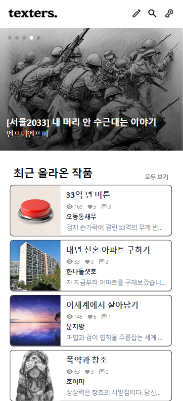
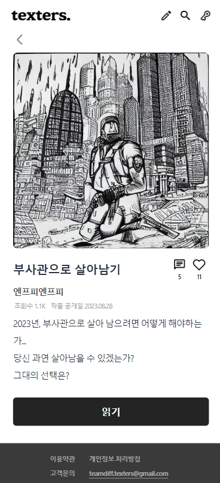
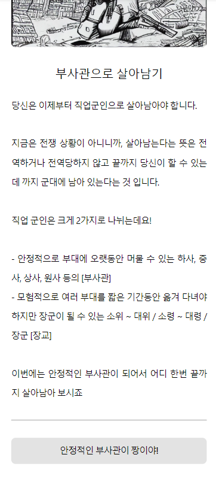
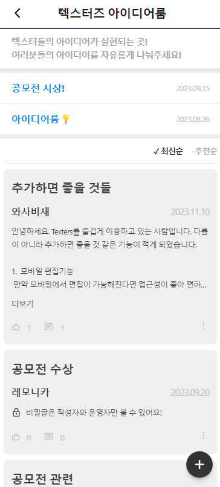
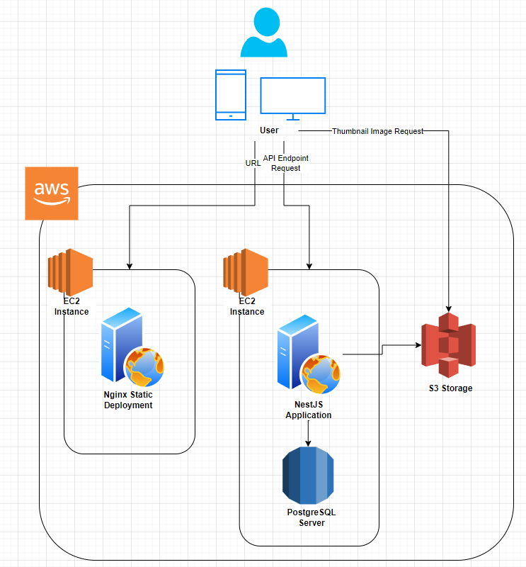

# 멀티엔딩 웹소설 플랫폼 텍스터즈

❓ Problem : 서울 2033, 모험가 이야기 같은 텍스트 어드벤쳐 게임, 텍스트 RPG 게임을 즐겨본 적이 있으신가요? 아니면 디트로이트 비컴 휴먼처럼 나의 선택에 따라 스토리의 줄기가 달라지는, 그리고 색다른 결말에 다다르는 게임을 즐겨본 적이 있으신가요? 우리는 그런 멀티플롯/멀티엔딩 소설/게임을 누구나 쉽게 만들 수 있으면 좋겠다고 생각했어요. 내가 만든 세계에서 독자들의 선택에 따라 달라지는 스토리를 읽을 수 있다면 보다 인터랙티브한 경험이 되지 않을까요? 😮

‼ Idea : 노코드 툴로 누구나 쉽게 드래그앤드랍, 자유로운 텍스트 입력으로 멀티엔딩 웹소설을 쓸 수 있게 해보자! 🤔

💯 Solution : 텍스터즈 스튜디오에서 나만의 멀티엔딩 소설을 써보고 다른사람들과 공유해보세요! 😁

## 웹사이트 texters.io

[웹사이트 바로가기](https://www.texters.io)
[백엔드 API Repository](https://github.com/team-ditt/texters-api)

  
  
  
  
  
  

## 주요기능

- **모바일 퍼스트 디자인**: 언제 어디서든 편하게 소설을 읽을 수 있게 모바일 디바이스에 집중. 반응형으로 제작된 웹사이트는 모바일 웹사이트 방문을 기본으로 가정하여 데스크톱은 확장된 뷰를 제공. 소설 작성 및 편집은 데스크톱 뷰만 제공.
- **작품 조회/정렬**: 조회수, 좋아요, 공개일자순으로 정렬 및 제목 키워드 검색 기능. 띄어쓰기 관계없이 제목에 포함된 키워드면 검색가능.
- **댓글/대댓글**: 독자들의 반응을 작품 댓글로 확인 가능. 권한별로 댓글 수정/삭제 가능 (본인 혹은 관리자). 스포일러 방지를 위한 옵션 설정 가능.
- **작품 감상 및 프리뷰**: 여러 선택지가 제공되는 작품을 모바일 화면으로 감상 가능. 텍스터즈 스튜디오에서 작품 편집 중에도 미리보기 기능 제공. 사용자들의 요청에 따라 직전 선택지로 돌아갈 수 있는 '뒤로가기' 버튼 제공.
- **SNS 로그인**: 간소화된 회원가입 절차를 제공하기 위해 카카오톡, 네이버, 구글 SNS 로그인 옵션 제공. 비회원 로그인 시도시 자동으로 회원가입 유도.
- **텍스터즈 스튜디오**: 자신이 작성한 작품을 모아볼 수 있음. 새로운 작품을 생성하거나 기존 작품의 수정 및 공개버전 업데이트 등의 기능을 제공. 초기에는 데스크톱 접근만 가능했으나 모바일에서도 관리가능하게 변경.
- **텍스터즈 에디터**: 노코드로 멀티엔딩 웹소설을 작성할 수 있게 해주는 인터랙티브 툴. 드래그 앤 드랍으로 각 페이지와 선택지를 연결지을 수 있음. Figma처럼 모바일에서 수정 불가능.

## 프로젝트 개발 기간

- 기획 및 MVP 개발: 2023.07.02 ~ 2022.07.27
- 운영 및 유지보수: 2023.07.27 ~ 현재

## 팀원

- **강동재** (@lucask04177): Project Owner
- **이정환** (@zake-dev): Full Stack Developer
- **권현우** (@holenet): Frontend Developer
- **이성선** : UI/UX Designer

## 기술 스택

- Front: React, Tailwind CSS, Zustand, React Query, Axios
- Backend: NestJS, TypeORM, PostgreSQL, AWS EC2/S3, Nginx

## ERD & 서버 아키텍쳐

  
  
  

## 프로젝트 회고

### 이정환 (@zake-dev), Frontend Developer

다음은 이번 프로젝트를 개발/운영하며 결정했던 사안들, 그 뒷이야기들에 대한 회고입니다.

기존의 스택을 유지하면서 Tailwind CSS를 추가하기

아무래도 작은 규모의 팀으로 빠르게 서비스를 출시해 테스트해보고 싶은 마음이 커 새로운 기술을 많이 도입하지는 못했습니다. 커뮤니티가 커 필요한 UI라이브러리를 빠르게 끌어다 쓸 수 있는 React, Redux보다 간단하게 전역 상태관리를 제공하는 Zustand, 서버데이터 상태관리 및 캐싱을 위해 React Query를 기본 베이스로 두고 빠른 UI 작성을 위해 Tailwind CSS를 도입했습니다. 유틸리티 기반 CSS로 작성하다 보니 옛날 Bootstrap을 쓰던 생각이 나면서도 더 동적인 값들을 사용할 수 있다는 점에서 만족스러웠습니다. HTML부분이 조금 비대해보이는 경향이 있으나 별도의 CSS파일이나 스타일드 문법을 보지 않고 레이아웃을 보며 CSS를 작성할 수 있는 것이 좋았습니다.

우리의 제품 vs 사용자의 제품 - 니즈를 파악하기

MVP 개발 이후 운영과정에서 사용자의 피드백으로 기능을 발전시켜 보는 경험이 매우 즐거웠습니다. 우리가 예상했던, 혹은 필요했다고 생각하는 제약이나 기능들이 사용자의 니즈와 꽤 다를 수 있다는 것을 알게되었어요. 우리의 색깔도 중요하지만 동시에 사용자의 니즈에 따라 카멜레온처럼 색깔을 바꿀수도 있어야 한다는 것을 배웠습니다.
  
초기 설계에는 '뒤로가기' 버튼도, 작품 공개 후 수정하는 것도 불가능했어요. 우리가 생각했을 때 하나 하나의 작품은 완결된 '게임'이었어요. 그래서 완결된 게임을 이후에 수정하거나, 처음부터 플롯을 따라가지 않고 '뒤로가기'로 여러 선택을 빠르게 훑어보는 것은 _나쁘다_라고 생각했었죠. 하지만 생각보다 많은 사용자들은 더 즉각적인 보상, 그리고 미완된 내용도 검증받아보고 싶어했어요. 발 빠르게 의견을 수용하고 기존 설계를 변경했던 것이 기억에 남습니다.

설계를 변경하며 데이터 마이그레이션 하기

초반에는 작품 공개전환율이 많이 낮았습니다. 10작품당 1~2작품 정도만 공개되었는데요. 아무래도 작품을 한 번 공개하면 다시 수정할 수 없다는 부담감이 공개전환을 꺼리게 하는 것 같다고 판단했습니다. 그래서 기존 원본 작품 데이터에 플래그를 두고 공개여부를 세팅하는 것이 아닌, 원본-복사본을 같이 두고 공개/업데이트시마다 스냅샷으로 복사본을 생성해 일반 독자들에게 작품을 보여줬습니다. 덕분에 10작품당 3~4작품 정도로 공개전환율이 올라가게 되었는데요. 프로덕트가 정말 애자일하려면 운영자의 고집보다 데이터와 사용자의 피드백을 더 존중해야 한다는 점을 배웠습니다.

항상 사소한 애니메이션 구현이 가장 어렵다

이번 프로젝트 프론트엔드 단에서 가장 어려운 파트는 당연히 텍스터즈 에디터였습니다. 그 코어 파트를 현우님이 담당해주었다 보니 저는 어려울 것 없이 백엔드에 집중할 수 있겠다 생각했었죠. 하지만 생각보다 자잘한 애니메이션을 구현하는데 코스트가 들었습니다.
  
단순히 모바일뷰의 확장된 데스크톱 반응형 페이지를 만들기 위해서는 flexbox만 사용하면 충분하지만, 조금 더 모바일 앱과 비슷한 느낌을 주고 싶어 로그인, 회원가입 과정 페이지 애니메이션을 화면 위에 쌓이는 스택형태로 구현하자니 다른 방법이 필요했습니다. Window resize이벤트와 마운트 당시 화면 사이즈를 계산해 `postion: absolute`로 화면 바깥 쪽 거터를 넣어두었는데요. 더 좋은 방법은 없었을까 고민이 듭니다.

이번에도 TDD는 실패, 그래도 API E2E 테스트는 성공적

이번 프로젝트야말로 기필코 TDD, 아니면 최소한의 테스트를 도입하고자 했었는데요. 여러 자료를 찾아보고 강의를 보아도 프론트엔드 테스트코드 작성방식을 잘 모르겠고, 특히 단순한 UI로직에 테스트 검증을 넣는 것에 어떤 의미가 있는지 고민이 들었습니다. 비즈니스로직도 에디터 파트를 제외하면 복잡한 부분이 없어 기술부채로 남겨두고 빠르게 기능구현에 집중했습니다. 기회가 된다면 현업에서 프론트엔드 테스트를 작성하고 개발하는 사이클을 함께 해보며 테스트 방법을 배우고 싶습니다.
  
백엔드 단에서는 모킹으로 유닛테스트를 도입해보려 시도하다 각 모듈 내에서는 대부분의 로직이 단순한 DB CRUD에 가깝고 연계적으로 발생하는 데이터 처리가 더 많아 유닛테스트를 생략한 채 E2E 테스트만 도입했습니다. Postman을 이용해 작품 생성/수정/삭제하는 시나리오를 테스트셋으로 작성하고 검증했는데요. 확실히 테스트가 있으니 이후 리팩토링이 필요할 때, 혹은 기능을 확장할 때 테스트를 믿고 코드를 고칠 수 있어 마음이 편했습니다.

